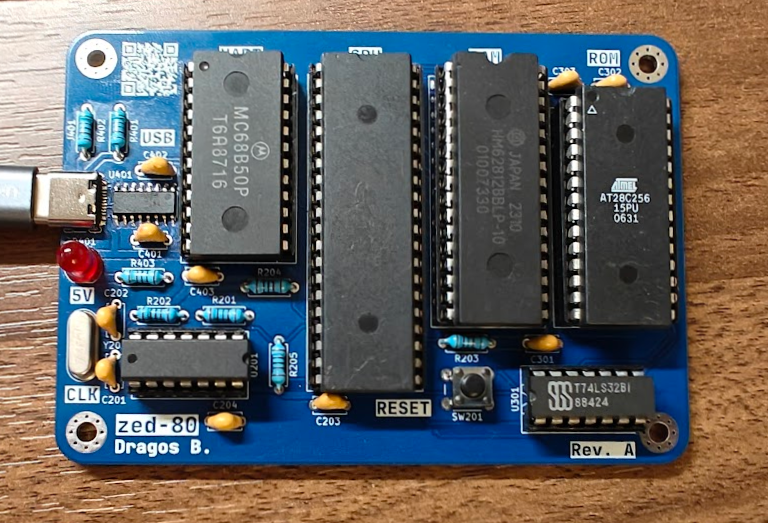

# zed-80
Simple Z80 computer based on Grant Searle's Z80 computer.

### Board

The first iteration of the board had an issue with the clock circuit since I used a 74LS04, which is a non-CMOS IC. The modified Pierce oscillator circuit I made does not function with non-CMOS inverters.

With a modified resistor configuration and a 74HCT04 inverter, I did manage to get a stable clock. However, the UART IC never let the CTS pin to low, therefore never sending any data. Without a logic analyzer, I am unable to check whether the IC, circuit, or the assembly code is bad.

Another issue with my attempt to make this board very quickly is that I based my design almost completely on Grant Searle's Z80 design and used his ported code directly, which gives me less room for making my own changes. For the next version I will base it more on my own design and try the modular ROMWBW firmware instead, which should give me more chances to modify it for my own needs.

### Programmer

The programmer is based on the TommyPROM project, but I turned it into an Arduino Uno shield, which makes it more compact and easy to use. However, my version is limited to flashing only the AT28C256, which makes it much less useful for other projects. For future endeavors, I will most likely buy an XGecu T48 programmer to remove extra points of failure.
